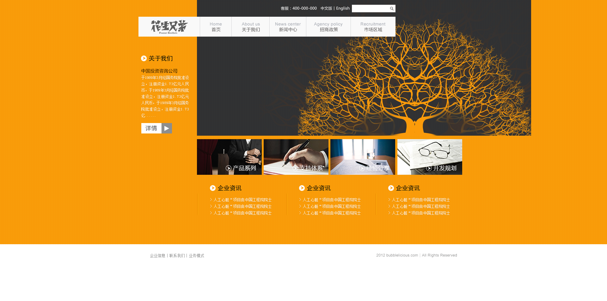
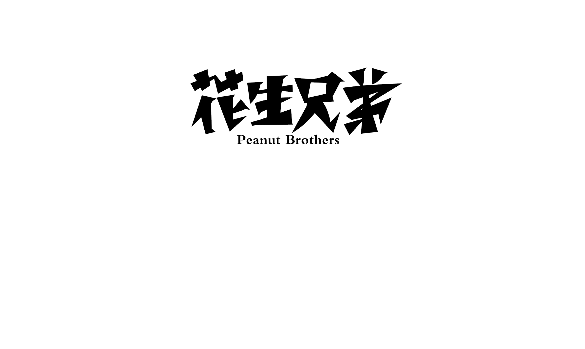
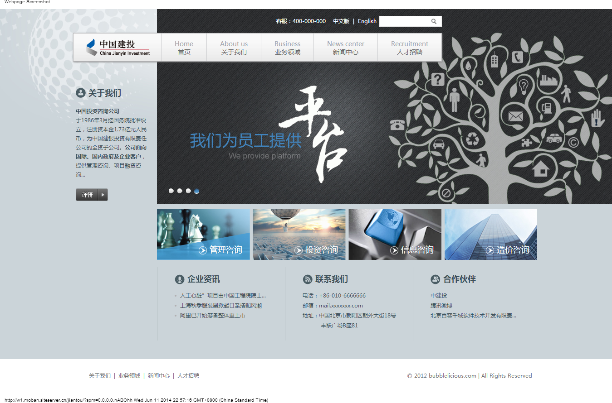
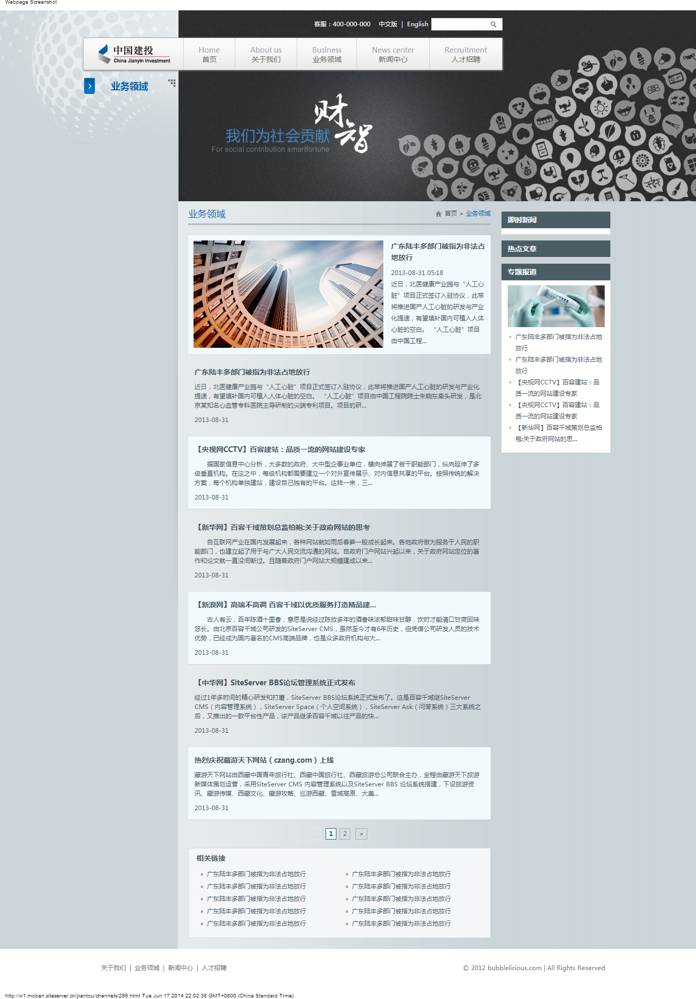

花生兄弟WEB UI设计
=======

## UI设计需求

*   __网站主色调修改为橘黄色__
*   __整体布局与设计都参考__ [_UI参考模板_]
*   __共计3个设计页面__

## 页面内容

>   导航菜单名称分别为

>>1、    关于我们
>>2、    新闻中心
>>3、    招商政策
>>4、    市场区域

>   4个图片区块名称分别为

>>1、产品系列
>>2、支持体系
>>3、经验分享
>>4、开发规划

>   底部导航菜单名称分别为
>>1、    企业信息
>>2、    联系我们
>>3、    业务模式

##设计效果图参考
>	

##网站界面与前端设计参考站点
> [http://w1.moban.siteserver.cn/jiantou/?spm=0.0.0.0.cjWOW6#](http://w1.moban.siteserver.cn/jiantou/?spm=0.0.0.0.cjWOW6#)

##网站LOGO

> 

##UI参考模板
>   
>   

